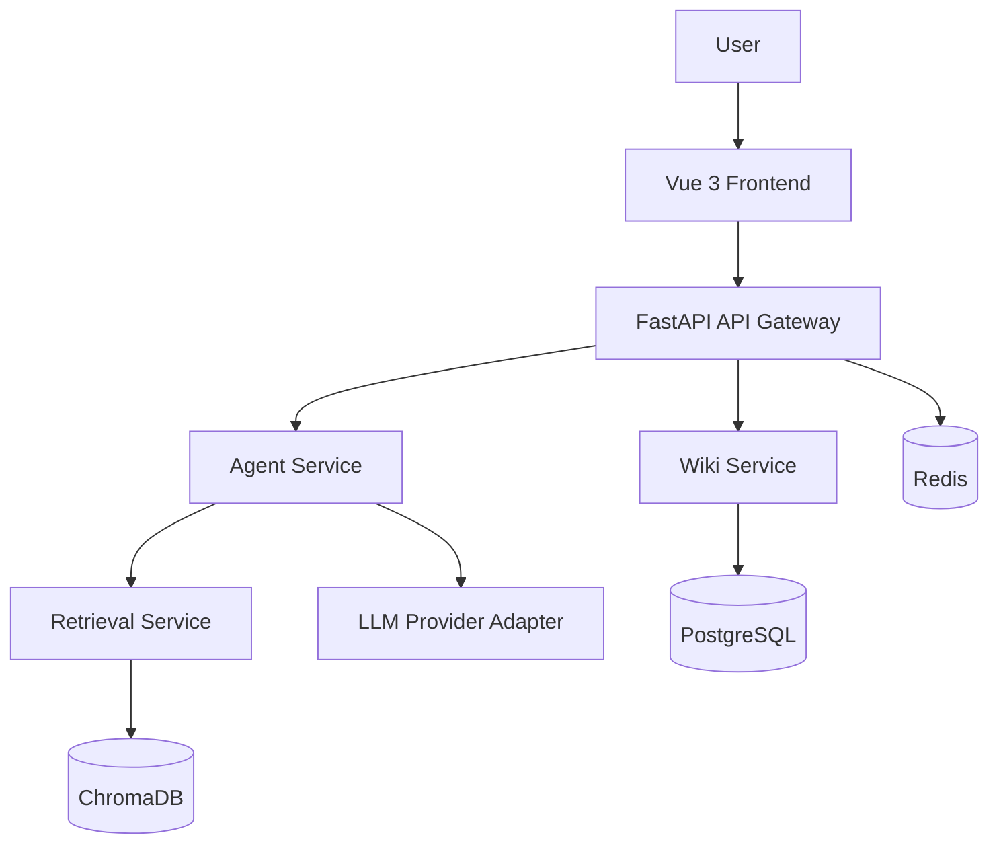

# OpsMind 项目设计

## 1. 项目目标

企业内部运维知识通常分散在 Wiki、Word、PDF、聊天记录、工单系统和 Git 仓库中。OpsMind 的目标是统一管理这些知识，并通过语义检索和大语言模型降低知识查找成本。

平台主要面向运维工程师、新入职成员、技术负责人和知识库管理员。

## 2. 功能范围

### Wiki 管理

- 创建、编辑、删除和版本化管理页面
- 管理分类与标签
- 上传 Markdown、PDF、DOCX 和 TXT 文件
- 保留文档元数据和索引状态

### 智能检索与问答

- 支持关键词检索、语义检索和混合检索
- 根据企业知识库回答运维问题
- 展示文档名称、引用位置和相似度信息
- 在知识不足时明确说明不确定性

### 文档总结与故障案例

- 生成文档摘要、知识提炼和新人学习路径
- 记录故障现象、原因、排查过程、修复方案和复盘结论
- 推荐相似故障案例

### Agent 工具调用

- Wiki Search Tool
- Document Search Tool
- Knowledge Summary Tool
- LLM Tool

首期 Agent 工具默认只读，不直接执行生产环境命令。

## 3. 技术架构



| 组件 | 用途 |
| --- | --- |
| Vue 3、Element Plus、Axios | 前端页面与 API 调用 |
| FastAPI、SQLAlchemy、Pydantic | API、业务逻辑和数据访问 |
| PostgreSQL | 用户、权限、Wiki、案例和配置数据 |
| Redis | 会话缓存、Agent 状态、热点缓存和限流 |
| ChromaDB | Embedding 存储和语义检索 |
| LangChain、ReAct Agent | 工具编排和 AI 问答 |

## 4. 核心流程

### 文档入库

```text
Upload -> Validate -> Parse -> Chunk -> Embed -> Index -> Mark Ready
```

### 智能问答

```text
Question -> Analyze -> Retrieve -> Rank -> Build Context -> Call LLM
         -> Attach Citations -> Return Answer -> Write Audit Log
```

## 5. 开发约定

- 配置通过环境变量注入，不提交真实密钥。
- 后端接口统一添加版本前缀，例如 `/api/v1`。
- 数据库结构变更必须提供迁移脚本。
- 新增功能应补充必要测试和文档。
- 提交信息建议遵循 Conventional Commits，例如 `feat: add semantic search endpoint`。

建议目录结构：

```text
OpsMind/
├── backend/
├── frontend/
├── docs/
├── deploy/
└── README.md
```

## 6. 部署规划

计划使用 Docker Compose 编排以下服务：

| 服务 | 用途 |
| --- | --- |
| `frontend` | Web 页面 |
| `backend` | FastAPI 接口 |
| `worker` | 文档解析、Embedding 和索引任务 |
| `postgres` | 业务数据 |
| `redis` | 缓存、队列和限流 |
| `chromadb` | 向量索引 |
| `nginx` | 反向代理 |

生产环境需要配置 TLS、持久化存储、备份恢复、网络访问限制、文件上传校验和操作审计。

## 7. 路线图

### Phase 1：知识库基础能力

- Wiki、分类、标签和文档上传
- 文档解析、索引和基础权限
- PostgreSQL、Redis 和 ChromaDB 集成

### Phase 2：智能检索与问答

- 关键词检索、语义检索和结果融合
- 带引用来源的 AI 问答
- 文档总结和故障案例推荐

### Phase 3：Agent 与可观测性

- ReAct Agent 工具调用
- 可配置 LLM Provider
- Prometheus 指标和 Grafana 仪表盘

### Phase 4：高级运维能力

- MCP 接入
- 多 Agent 协同分析
- Kubernetes 运维助手
- 受控的 SSH 远程执行
- 带人工审批的自动故障处理

