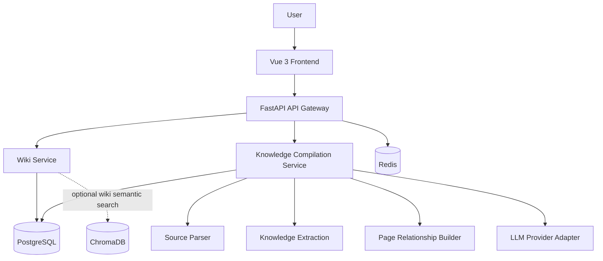

# OpsMind 项目设计

## 1. 项目目标

企业内部运维知识通常分散在 Wiki、Word、PDF、聊天记录、工单系统和 Git 仓库中。OpsMind 的目标不是把这些资料简单切片后做 RAG 检索，而是利用大语言模型把原始资料持续整理、归纳、融合和维护为结构化 Wiki 知识库。

平台主要面向运维工程师、新入职成员、技术负责人和知识库管理员。

本项目中的 LLM Wiki 指：

```text
利用 LLM 将原始资料持续整理、归纳、融合、维护为结构化知识库，使知识能够被沉淀、演化和复用。
```

核心思想是：

```text
Knowledge Compilation
知识编译
```

而不是：

```text
Knowledge Retrieval
知识检索
```

## 2. 功能范围

### Wiki 管理

- 创建、编辑、删除和版本化管理 Wiki 页面
- 管理分类、标签、页面关系和知识修订记录
- 上传 Markdown、PDF、DOCX、TXT 等原始资料
- 保留原始资料元数据、解析状态和知识提炼状态

### 知识编译

- 从原始资料中提取候选知识点
- 将候选知识点归纳为概念页、人物页、系统页、流程页、规则页、术语页、事件页和故障页
- 判断新知识应创建新页面、合并到旧页面，还是形成页面修订
- 维护页面之间的引用、依赖、相似、上下游和归属关系
- 记录每次知识生成、合并和修订的来源与原因

### Wiki 搜索与问答

- 搜索 Wiki 页面、标签、标题、摘要和页面关系
- 可以引入语义搜索辅助定位 Wiki 页面，但不直接以原始 chunk 作为主查询资产
- 基于相关 Wiki 页面回答运维问题
- 展示关联页面、知识来源和修订信息
- 在 Wiki 知识不足时明确说明不确定性

### 故障案例与知识沉淀

- 记录故障现象、原因、排查过程、修复方案和复盘结论
- 将故障案例转化为可维护的故障页、规则页或流程页
- 发现相似故障案例和相关系统、组件、流程

### LLM 工具调用

- Source Parse Tool
- Knowledge Extraction Tool
- Wiki Page Update Tool
- Page Relationship Tool
- Wiki Search Tool
- LLM Answer Tool

首期工具默认只读或只写入本地知识库，不直接执行生产环境命令。

## 3. 技术架构



| 组件 | 用途 |
| --- | --- |
| Vue 3、Element Plus、Axios | 前端页面与 API 调用 |
| FastAPI、SQLAlchemy、Pydantic | API、业务逻辑和数据访问 |
| PostgreSQL | 用户、权限、Wiki 页面、页面关系、修订记录、案例和配置数据 |
| Redis | 会话缓存、任务状态、热点页面缓存和限流 |
| ChromaDB | 可选的 Wiki 页面语义搜索辅助能力，不作为原始 chunk 检索主线 |
| LLM Provider、工具编排 | 知识提炼、页面生成、页面更新、关系发现和基于 Wiki 的问答 |

## 4. 核心流程

### 原始资料入库

```text
Upload -> Validate -> Save Source -> Create Compilation Job -> Mark Pending
```

原始资料用于后续知识提炼，不是系统长期面向用户查询的主要知识层。

### 知识编译

```text
Source Document -> Parse -> LLM Understand -> Extract Knowledge Units
                -> Normalize -> Generate or Update Wiki Pages
                -> Build Page Relationships -> Record Revision
```

### 基于 Wiki 的问答

```text
Question -> Locate Wiki Pages -> Read Page Content and Relationships
         -> Call LLM -> Return Answer with Related Wiki Pages
         -> Write Audit Log
```

## 5. LLM Wiki 与 RAG 的边界

传统 RAG 的核心资产是：

```text
Chunk
Embedding
Vector Index
```

OpsMind LLM Wiki 的核心资产是：

```text
Wiki Page
Knowledge Unit
Page Relationship
Knowledge Revision
Compilation Job
```

项目不排斥搜索能力，也不排斥未来引入向量检索。但搜索必须服务于 Wiki 页面定位，不能把“搜索原始文本片段并拼接上下文”作为主产品路线。

## 6. 开发约定

- 配置通过环境变量注入，不提交真实密钥。
- 后端接口统一添加版本前缀，例如 `/api/v1`。
- 数据库结构变更必须提供迁移脚本。
- 新增功能应补充必要测试和文档。
- 文档、接口命名和模块命名应优先体现 Wiki、知识编译、页面维护、知识修订和页面关系。
- 避免把主流程命名为 RAG、Chunk Search、Document Retrieval 或 Vector QA。

建议目录结构：

```text
OpsMind/
├── backend/
├── frontend/
├── docs/
├── deploy/
└── README.md
```

## 7. 部署规划

计划使用 Docker Compose 编排以下服务：

| 服务 | 用途 |
| --- | --- |
| `frontend` | Web 页面 |
| `backend` | FastAPI 接口 |
| `worker` | 资料解析、知识提炼、Wiki 页面更新和关系构建任务 |
| `postgres` | 业务数据与 Wiki 知识层 |
| `redis` | 缓存、任务状态和限流 |
| `chromadb` | 可选的 Wiki 页面语义搜索辅助索引 |
| `nginx` | 反向代理 |

生产环境需要配置 TLS、持久化存储、备份恢复、网络访问限制、文件上传校验和操作审计。

## 8. 路线图

### Phase 1：Wiki 基础能力

- 用户、权限、审计
- Wiki 页面、分类、标签、附件和版本
- PostgreSQL、Redis 和本地运行环境

### Phase 2：LLM Wiki 知识编译

- 原始资料解析
- 知识点提取与归一化
- Wiki 页面生成、合并、更新和修订
- 页面关系构建

### Phase 3：Wiki 搜索与问答

- Wiki 页面关键词搜索
- 可选的 Wiki 页面语义搜索
- 基于 Wiki 页面和页面关系的 AI 问答
- 故障案例知识化

### Phase 4：工具编排与可观测性

- LLM 工具编排
- 可配置 LLM Provider
- 知识编译任务审计
- Prometheus 指标和 Grafana 仪表盘

### Phase 5：高级运维能力

- MCP 接入
- 多 Agent 协同分析
- Kubernetes 运维助手
- 受控的 SSH 远程执行
- 带人工审批的自动故障处理
